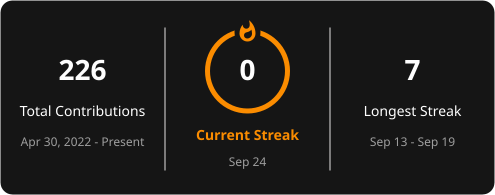
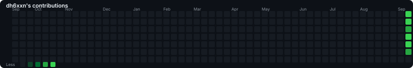

<p align="center">
  
</p>

<h2 align="center">AI/ML Enthusiast • Cybersecurity Explorer • Builder</h2>

<p align="center">
  <em>Learning, experimenting, and building things with AI and technology.</em>
</p>

<p align="center">
  <a href="mailto:dhananjayrshaju2503@gmail.com">
    
  </a>
  <a href="https://linkedin.com/in/dhananjayrshaju">
    
  </a>
  <a href="https://instagram.com/dh6xxn">
    
  </a>
</p>

---

## 👋 About Me

I'm **Dhananjay R Shaju**, an AI/ML student passionate about building practical technology and exploring the intersection of **Artificial Intelligence, Machine Learning, and Cybersecurity**.

* 🤖 Exploring **Artificial Intelligence & Machine Learning**
* 🔐 Exploring **Cybersecurity & ethical security**
* 🧠 Learning how intelligent systems work and how to build them
* 🛠️ Turning ideas into practical projects
* 🌱 Continuously improving my development and ML skills
* 🤝 Open to collaborating on interesting **AI/ML & Cybersecurity projects**
* 🚀 Always looking for something new to build

---

## 🧠 What I'm Exploring

<p align="center">
  
  
  
  
</p>

---

## 🛠️ Tech Stack

### 💻 Languages

<p align="center">
  
</p>

### 🌐 Web Development

<p align="center">
  
</p>

### 🤖 AI / ML

<p align="center">
  
</p>

### 🗄️ Databases

<p align="center">
  
</p>

### ⚙️ Tools & Environment

<p align="center">
  
</p>

---

## 📊 GitHub Statistics

<p align="center">
  <a href="https://github.com/dh6xxn">
    
  </a>
  <a href="https://github.com/dh6xxn">
    
  </a>
</p>

<p align="center">
  
</p>

---

## 📈 Contribution Activity

<p align="center">
  
</p>

## 🐍 Contribution Snake

<p align="center">
  <picture>
    <source media="(prefers-color-scheme: dark)" srcset="./profile/github-snake-dark.svg" />
    <source media="(prefers-color-scheme: light)" srcset="./profile/github-snake.svg" />
    
  </picture>
</p>

---


## 🏆 GitHub Trophies

<p align="center">
  
</p>


## 🚀 What I'm Building

<p align="center">
  <em>Turning ideas into projects, experiments into experience, and code into useful things.</em>
</p>

<table align="center">
<tr>
<td width="50%" align="center">

### 🤖 AI / ML

Exploring machine learning, intelligent systems, automation, and practical AI applications.

</td>
<td width="50%" align="center">

### 🔐 Cybersecurity

Learning security concepts, experimenting with tools, and exploring the intersection of security and technology.

</td>
</tr>
</table>

---

## 🎯 Current Focus

```text
Artificial Intelligence   ███████████████████░   Learning & Building
Machine Learning          ██████████████████░░   Experimenting
Cybersecurity             ███████████████░░░░░   Exploring
Web Development           ██████████████░░░░░░   Building
````

---

## 🌱 Learning Journey

```text
AI / ML
  ├── Machine Learning
  ├── Deep Learning
  ├── Model Development
  └── Practical AI Projects

Cybersecurity
  ├── Security Fundamentals
  ├── Ethical Hacking
  ├── Security Tools
  └── Secure Development

Development
  ├── Python
  ├── JavaScript / TypeScript
  ├── Databases
  └── Git & GitHub
```

---

## 🤝 Let's Connect

<p align="center">
  <a href="mailto:dhananjayrshaju2503@gmail.com">
    
  </a>
  <a href="https://linkedin.com/in/dhananjayrshaju">
    
  </a>
  <a href="https://instagram.com/dh6xxn">
    
  </a>
</p>


---

<p align="center">
  
</p>

<p align="center">
  <strong>Thanks for visiting my profile! 🚀</strong>
</p>
```

